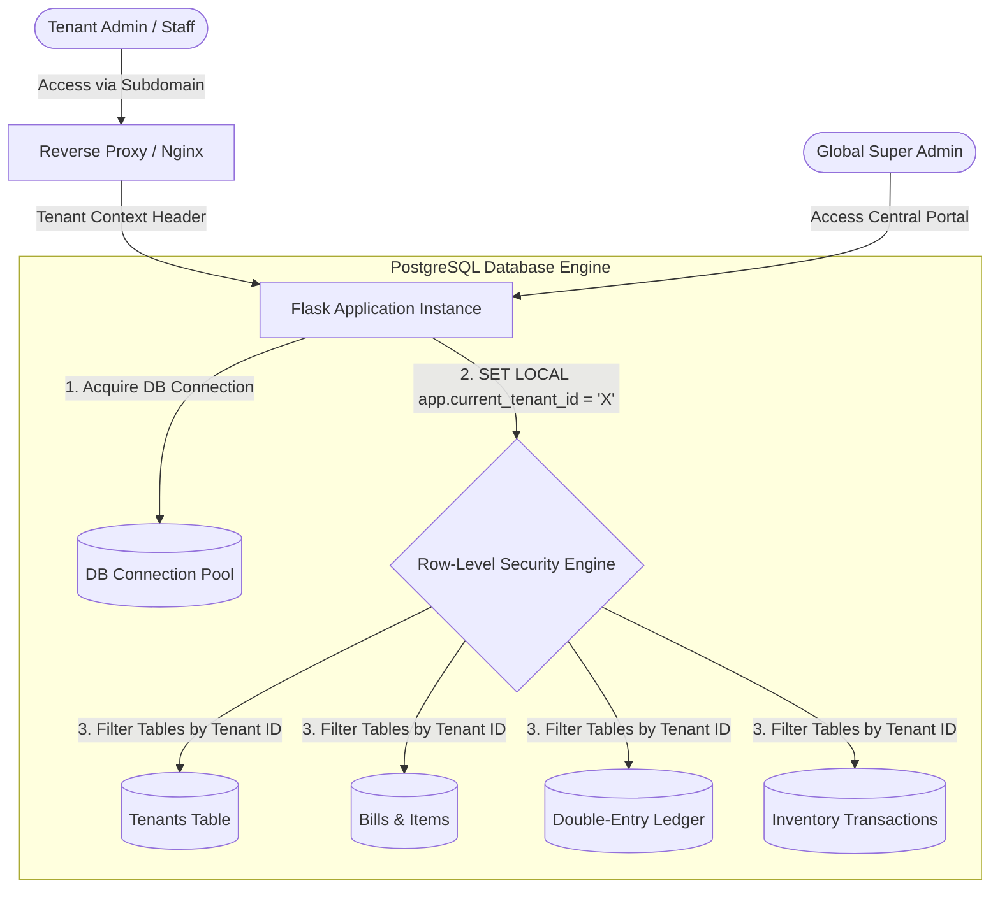

# Vyaprix Multi-Tenant SaaS, Security, GST Compliance & ERP Specification
## Powered by Vyaprix Software under Padashetty Softwares

This document provides a production-grade, highly secure, and compliant specification for converting the billing system into a secure, universal multi-tenant SaaS platform called **Vyaprix**. It combines raw technical implementation code, SQL schemas, and backend algorithms with a complete security architecture, double-entry financial ledger, background queues, and full Indian GST compliance under a shared database schema, designed to be completely industry-agnostic so any retail, wholesale, service, or distribution business can utilize it.

---

## 1. System Architecture Design

The multi-tenant architecture uses a **Shared Database, Shared Schema with Logical Isolation** approach. To ensure that no tenant can ever access another's data, and that even the SuperAdmin cannot view individual tenant billing transaction records, we employ **PostgreSQL Row-Level Security (RLS)** combined with application-level dynamic routing context.



### Core Architecture Components
1. **Web / Application Server**: Python Flask framework (retaining the high-performance patterns of the standalone system, including raw SQL/SQLAlchemy speed, decimal-safe financial calculations, and secure authentication).
2. **Database Engine**: PostgreSQL. This is mandatory because it natively supports Row-Level Security (RLS), custom transaction variables, and schemas suited for micro-second query execution.
3. **Tenant Routing & Context Resolution**:
   - **Subdomain Routing**: Each tenant gets a unique subdomain (e.g., `tenant1.vyaprix.com`, `tenant2.vyaprix.com`).
   - **Context Middleware**: A Flask `before_request` hook extracts the tenant identifier from the host header, looks up the corresponding tenant in the master table, and stores it in Flask's thread-local global context `g.tenant_id`.
   - **PostgreSQL Session Context**: On every database query/transaction, the application sets a local PostgreSQL variable within the current transaction block:
     ```sql
     SET LOCAL app.current_tenant_id = 'tenant_uuid_here';
     ```
     This forces the PostgreSQL engine to dynamically evaluate and apply RLS policies for all executed queries.

---

## 2. Advanced Security & Cryptography Protocol

### Row-Level Security (RLS) Implementation
SQLAlchemy ORM code can sometimes contain bugs or missing filters in `filter_by(tenant_id=...)`. RLS acts as a secondary, immutable gatekeeper inside the database engine itself:
- **Impenetrable Queries**: Enabling RLS means PostgreSQL automatically appends the filtering condition `WHERE tenant_id = app.current_tenant_id` to every select, update, insert, and delete command before execution.
- **Insecure Direct Object Reference (IDOR) Protection**: Even if a malicious user alters an ID in an HTTP request to point to another tenant's bill (`/bill/100`), the database returns a `404 Not Found` because RLS filters out rows belonging to other tenants.
- **Constraint Uniqueness Isolation**: Standard unique constraints (such as `sku`, `phone`, and `username`) are refactored to be multi-tenant composite constraints: `(tenant_id, sku)`, `(tenant_id, phone)`, and `(tenant_id, username)`. This prevents namespace collisions across different tenants.

### Authentication & Session Hijacking Countermeasures
- **Isolated Sessions**: Sessions are scoped to specific tenant subdomains by setting cookie constraints dynamically (e.g., `SESSION_COOKIE_DOMAIN = tenant_subdomain`). A user session initiated on Tenant A's subdomain will not be parsed or recognized on Tenant B's subdomain.
- **Brute-Force Lockout System**: Each tenant's users are protected by a dynamic brute-force lockout policy (5 failed attempts locks the user account for 15 minutes). The failure count and lockouts are tracked strictly inside the user record corresponding to that specific tenant.
- **Role-Based Privilege Boundaries (RBAC)**:
  - **SuperAdmin**: Accesses a central portal to register new tenants, configure pricing plans, manage photos, customize tenant structures, and activate/suspend tenant accounts. **SuperAdmin has no policy privileges to view or read any tenant's inventory, billing transactions, double-entry financial ledger accounts, customer registries, or GSTR compliance reports.**
  - **Tenant Admin**: Full read/write over their specific tenant parameters, catalog, sales registers, account heads, soft-delete restores, and staff management.
  - **Tenant Staff**: POS billing execution, search catalog, and walk-in invoice entry. Restricted from exporting databases, modifying past bills, making manual ledger adjustments, or editing store configurations.

### Cryptographic Protocols & Network Security
- **Asset Cryptographic Separation**: Static files (uploaded invoices, product photos, business signatures, company logos) are isolated using physical directories structures `/static/uploads/<tenant_uuid>/...`.
- **TLS 1.3 Enforcement**: High-strength encryption in transit secures billing APIs.
- **Secret Key Rotation**: The Flask app loads tenant-specific JWT keys or database configuration files securely without hardcoding variables, using environment values fetched dynamically.

---

## 3. Database Design & Schema Enhancements

To transform the database into a multi-tenant system while maintaining single-database efficiency, we introduce a central `tenants` table. Every other table is augmented with a `tenant_id` column.

### Complete Enhanced SQL Schema Definition
Below is the strict PostgreSQL schema migration script, detailing RLS policies, foreign keys, and indexes:

```sql
-- 1. EXTENSIONS
CREATE EXTENSION IF NOT EXISTS "uuid-ossp";

-- 2. MASTER TENANTS TABLE
CREATE TABLE IF NOT EXISTS tenants (
  id UUID PRIMARY KEY DEFAULT uuid_generate_v4(),
  company_name VARCHAR(200) NOT NULL,
  subdomain VARCHAR(50) UNIQUE NOT NULL,
  logo_path VARCHAR(255),
  address TEXT NOT NULL,
  gstin VARCHAR(15), -- Global/Default GSTIN for the tenant
  state_code VARCHAR(2) NOT NULL,
  business_type VARCHAR(50) DEFAULT 'retail', -- retail, wholesale, service, supermarket, manufacturing
  is_active BOOLEAN NOT NULL DEFAULT TRUE,
  created_at TIMESTAMPTZ NOT NULL DEFAULT NOW(),
  updated_at TIMESTAMPTZ NOT NULL DEFAULT NOW()
);

-- 3. SAAS SUBSCRIPTIONS & QUOTA TABLE
CREATE TABLE IF NOT EXISTS tenant_subscriptions (
  id SERIAL PRIMARY KEY,
  tenant_id UUID NOT NULL REFERENCES tenants(id) ON DELETE CASCADE,
  plan_name VARCHAR(50) NOT NULL DEFAULT 'basic', -- basic, professional, enterprise
  max_products INTEGER NOT NULL DEFAULT 500,
  max_bills_per_month INTEGER NOT NULL DEFAULT 1000,
  current_bills_this_month INTEGER NOT NULL DEFAULT 0,
  billing_cycle_start TIMESTAMPTZ NOT NULL DEFAULT NOW(),
  billing_cycle_end TIMESTAMPTZ NOT NULL,
  stripe_customer_id VARCHAR(100),
  stripe_subscription_id VARCHAR(100),
  status VARCHAR(20) NOT NULL DEFAULT 'active', -- active, past_due, suspended, cancelled
  created_at TIMESTAMPTZ NOT NULL DEFAULT NOW(),
  updated_at TIMESTAMPTZ NOT NULL DEFAULT NOW()
);

-- 4. UPDATED ADMIN USERS TABLE (Multi-Tenant Unique Constraint)
CREATE TABLE IF NOT EXISTS admin_users (
  id SERIAL PRIMARY KEY,
  tenant_id UUID REFERENCES tenants(id) ON DELETE CASCADE,
  username VARCHAR(50) NOT NULL,
  password_hash VARCHAR(255) NOT NULL,
  role VARCHAR(20) NOT NULL DEFAULT 'staff',
  is_active BOOLEAN NOT NULL DEFAULT TRUE,
  last_login TIMESTAMPTZ,
  failed_login_count INTEGER NOT NULL DEFAULT 0,
  locked_until TIMESTAMPTZ,
  created_at TIMESTAMPTZ NOT NULL DEFAULT NOW(),
  updated_at TIMESTAMPTZ NOT NULL DEFAULT NOW(),
  CONSTRAINT chk_admin_role CHECK (role IN ('superadmin','staff')),
  CONSTRAINT uq_tenant_username UNIQUE (tenant_id, username)
);

-- 5. CATEGORIES TABLE WITH TENANT ISOLATION
CREATE TABLE IF NOT EXISTS categories (
  id SERIAL PRIMARY KEY,
  tenant_id UUID NOT NULL REFERENCES tenants(id) ON DELETE CASCADE,
  name VARCHAR(100) NOT NULL,
  sort_order INTEGER DEFAULT 0,
  created_at TIMESTAMPTZ NOT NULL DEFAULT NOW(),
  deleted_at TIMESTAMPTZ
);

-- 6. CUSTOMER REGISTRY WITH TENANT ISOLATION & CREDIT BALANCES
CREATE TABLE IF NOT EXISTS customers (
  id SERIAL PRIMARY KEY,
  tenant_id UUID NOT NULL REFERENCES tenants(id) ON DELETE CASCADE,
  name VARCHAR(200) NOT NULL,
  phone VARCHAR(20),
  address TEXT,
  gstin VARCHAR(20),
  loyalty_points INTEGER DEFAULT 0,
  credit_limit NUMERIC(12,2) NOT NULL DEFAULT 50000.00,
  current_due NUMERIC(12,2) NOT NULL DEFAULT 0.00,
  deleted_at TIMESTAMPTZ,
  created_at TIMESTAMPTZ NOT NULL DEFAULT NOW(),
  updated_at TIMESTAMPTZ NOT NULL DEFAULT NOW(),
  CONSTRAINT uq_tenant_customer_phone UNIQUE (tenant_id, phone)
);

-- 7. PRODUCTS TABLE (Universal Inventory Model with Soft Delete)
CREATE TABLE IF NOT EXISTS products (
  id SERIAL PRIMARY KEY,
  tenant_id UUID NOT NULL REFERENCES tenants(id) ON DELETE CASCADE,
  name VARCHAR(200) NOT NULL,
  sku VARCHAR(50) NOT NULL,
  category_id INTEGER REFERENCES categories(id),
  cost_price NUMERIC(12,2) NOT NULL DEFAULT 0.00,
  price_per_unit NUMERIC(12,2) NOT NULL, -- Retail Sales Price
  wholesale_price NUMERIC(12,2),
  unit VARCHAR(20) NOT NULL DEFAULT 'pcs', -- pcs, kg, g, l, ml, box, meters, hours
  hsn_code VARCHAR(20), -- HSN for Goods, SAC for Services
  gst_rate NUMERIC(4,2) DEFAULT 0,
  barcode VARCHAR(100),
  image_path VARCHAR(255),
  stock_qty NUMERIC(12,3) NOT NULL DEFAULT 0,
  is_active BOOLEAN NOT NULL DEFAULT TRUE,
  deleted_at TIMESTAMPTZ,
  created_at TIMESTAMPTZ NOT NULL DEFAULT NOW(),
  updated_at TIMESTAMPTZ NOT NULL DEFAULT NOW(),
  CONSTRAINT uq_tenant_sku UNIQUE (tenant_id, sku)
);

-- 8. BILLS TABLE WITH MULTI-MODE PAYMENT SUPPORT AND INVOICE NUMBERS
CREATE TABLE IF NOT EXISTS bills (
  id SERIAL PRIMARY KEY,
  tenant_id UUID NOT NULL REFERENCES tenants(id) ON DELETE CASCADE,
  bill_number VARCHAR(30) NOT NULL, 
  customer_id INTEGER REFERENCES customers(id),
  operator_id INTEGER NOT NULL REFERENCES admin_users(id),
  bill_date TIMESTAMPTZ NOT NULL DEFAULT NOW(),
  subtotal NUMERIC(12,2) NOT NULL,
  discount_amount NUMERIC(12,2) DEFAULT 0,
  discount_type VARCHAR(10) DEFAULT 'flat',
  taxable_amount NUMERIC(12,2) NOT NULL,
  gst_amount NUMERIC(12,2) DEFAULT 0,
  grand_total NUMERIC(12,2) NOT NULL,
  amount_paid NUMERIC(12,2) NOT NULL DEFAULT 0,
  due_amount NUMERIC(12,2) NOT NULL DEFAULT 0,
  notes TEXT,
  status VARCHAR(15) DEFAULT 'confirmed',
  cancelled_at TIMESTAMPTZ,
  cancel_reason TEXT,
  created_at TIMESTAMPTZ NOT NULL DEFAULT NOW(),
  updated_at TIMESTAMPTZ NOT NULL DEFAULT NOW(),
  deleted_at TIMESTAMPTZ,
  CONSTRAINT uq_tenant_bill_number UNIQUE (tenant_id, bill_number),
  CONSTRAINT chk_discount_type CHECK (discount_type IN ('flat','percent')),
  CONSTRAINT chk_bill_status CHECK (status IN ('draft','confirmed','cancelled'))
);

-- 9. BILL ITEMS TABLE (CASCADE ON DELETION)
CREATE TABLE IF NOT EXISTS bill_items (
  id SERIAL PRIMARY KEY,
  tenant_id UUID NOT NULL REFERENCES tenants(id) ON DELETE CASCADE,
  bill_id INTEGER NOT NULL REFERENCES bills(id) ON DELETE CASCADE,
  product_id INTEGER NOT NULL REFERENCES products(id),
  product_name VARCHAR(200) NOT NULL,
  unit_price NUMERIC(12,2) NOT NULL,
  qty NUMERIC(12,3) NOT NULL,
  unit VARCHAR(20) NOT NULL,
  gst_rate NUMERIC(4,2) DEFAULT 0,
  hsn_code VARCHAR(20),
  line_total NUMERIC(12,2) NOT NULL
);

-- 10. MULTI-MODE PAYMENT SETTLEMENT LAYER
CREATE TABLE IF NOT EXISTS payment_settlements (
  id SERIAL PRIMARY KEY,
  tenant_id UUID NOT NULL REFERENCES tenants(id) ON DELETE CASCADE,
  bill_id INTEGER REFERENCES bills(id) ON DELETE CASCADE,
  customer_id INTEGER REFERENCES customers(id),
  payment_mode VARCHAR(20) NOT NULL, -- cash, upi, card, credit (due)
  amount NUMERIC(12,2) NOT NULL,
  transaction_reference VARCHAR(100), -- UPI txn id, card authorization code
  reconciliation_status VARCHAR(20) NOT NULL DEFAULT 'completed', -- pending, completed, failed
  settled_at TIMESTAMPTZ NOT NULL DEFAULT NOW(),
  CONSTRAINT chk_payment_mode CHECK (payment_mode IN ('cash','upi','card','credit'))
);

-- 11. CREDIT LEDGER (UDHAAR TRACKING)
CREATE TABLE IF NOT EXISTS credit_ledger (
  id SERIAL PRIMARY KEY,
  tenant_id UUID NOT NULL REFERENCES tenants(id) ON DELETE CASCADE,
  customer_id INTEGER NOT NULL REFERENCES customers(id) ON DELETE CASCADE,
  bill_id INTEGER REFERENCES bills(id) ON DELETE CASCADE,
  transaction_type VARCHAR(10) NOT NULL, -- CREDIT (increase due), DEBIT (payment received)
  amount NUMERIC(12,2) NOT NULL,
  running_balance NUMERIC(12,2) NOT NULL,
  note TEXT,
  created_at TIMESTAMPTZ NOT NULL DEFAULT NOW(),
  CONSTRAINT chk_credit_type CHECK (transaction_type IN ('CREDIT', 'DEBIT'))
);

-- 12. INVENTORY TRANSACTION LEDGER (NO SILENT STOCK MODIFICATIONS)
CREATE TABLE IF NOT EXISTS inventory_transactions (
  id SERIAL PRIMARY KEY,
  tenant_id UUID NOT NULL REFERENCES tenants(id) ON DELETE CASCADE,
  product_id INTEGER NOT NULL REFERENCES products(id) ON DELETE CASCADE,
  actor_id INTEGER NOT NULL REFERENCES admin_users(id),
  transaction_type VARCHAR(20) NOT NULL, -- purchase, sale, adjustment, return, damage, transfer
  change_qty NUMERIC(12,3) NOT NULL,
  before_qty NUMERIC(12,3) NOT NULL,
  after_qty NUMERIC(12,3) NOT NULL,
  reference_type VARCHAR(30), -- bills, purchases, adjustments
  reference_id INTEGER,
  note TEXT,
  created_at TIMESTAMPTZ NOT NULL DEFAULT NOW(),
  CONSTRAINT chk_inventory_txn_type CHECK (transaction_type IN ('purchase', 'sale', 'adjustment', 'return', 'damage', 'transfer'))
);

-- 13. FINANCIAL ACCOUNTS (CHART OF ACCOUNTS FOR DOUBLE-ENTRY BOOKKEEPING)
CREATE TABLE IF NOT EXISTS financial_accounts (
  id SERIAL PRIMARY KEY,
  tenant_id UUID NOT NULL REFERENCES tenants(id) ON DELETE CASCADE,
  code VARCHAR(50) NOT NULL, -- e.g. "10100" (Cash), "20100" (A/P), "40100" (Sales Revenue)
  name VARCHAR(150) NOT NULL,
  account_type VARCHAR(30) NOT NULL, -- asset, liability, equity, revenue, expense
  balance NUMERIC(14,2) NOT NULL DEFAULT 0.00,
  created_at TIMESTAMPTZ NOT NULL DEFAULT NOW(),
  updated_at TIMESTAMPTZ NOT NULL DEFAULT NOW(),
  CONSTRAINT uq_tenant_account_code UNIQUE (tenant_id, code),
  CONSTRAINT chk_account_type CHECK (account_type IN ('asset', 'liability', 'equity', 'revenue', 'expense'))
);

-- 14. DOUBLE-ENTRY JOURNAL ENTRIES
CREATE TABLE IF NOT EXISTS journal_entries (
  id SERIAL PRIMARY KEY,
  tenant_id UUID NOT NULL REFERENCES tenants(id) ON DELETE CASCADE,
  entry_date TIMESTAMPTZ NOT NULL DEFAULT NOW(),
  reference_type VARCHAR(50), -- bill, payment, purchase, inventory_adjustment
  reference_id INTEGER,
  description TEXT,
  created_at TIMESTAMPTZ NOT NULL DEFAULT NOW()
);

-- 15. DOUBLE-ENTRY JOURNAL ITEMS (DEBITS AND CREDITS MUST BALANCE)
CREATE TABLE IF NOT EXISTS journal_items (
  id SERIAL PRIMARY KEY,
  tenant_id UUID NOT NULL REFERENCES tenants(id) ON DELETE CASCADE,
  journal_entry_id INTEGER NOT NULL REFERENCES journal_entries(id) ON DELETE CASCADE,
  account_id INTEGER NOT NULL REFERENCES financial_accounts(id) ON DELETE RESTRICT,
  debit NUMERIC(14,2) NOT NULL DEFAULT 0.00,
  credit NUMERIC(14,2) NOT NULL DEFAULT 0.00,
  created_at TIMESTAMPTZ NOT NULL DEFAULT NOW(),
  CONSTRAINT chk_debit_credit CHECK (debit >= 0 AND credit >= 0),
  CONSTRAINT chk_one_has_value CHECK ((debit > 0 AND credit = 0) OR (credit > 0 AND debit = 0))
);

-- 16. ENHANCED AUDIT LOGGING SYSTEM (WHO, WHAT, WHEN, WHERE, STATE CHANGES)
CREATE TABLE IF NOT EXISTS audit_log (
  id SERIAL PRIMARY KEY,
  tenant_id UUID NOT NULL REFERENCES tenants(id) ON DELETE CASCADE,
  actor_id INTEGER REFERENCES admin_users(id),
  action VARCHAR(50) NOT NULL,   -- CREATE, UPDATE, DELETE, RESTORE, LOGIN, EXPORT
  entity VARCHAR(50) NOT NULL,   -- product, bill, customer, ledger, account
  entity_id INTEGER,
  old_value JSONB,
  new_value JSONB,
  ip_address VARCHAR(45) NOT NULL,
  device_info TEXT NOT NULL,      -- User-Agent containing OS, browser, hardware details
  created_at TIMESTAMPTZ NOT NULL DEFAULT NOW()
);

-- 17. TENANT SETTINGS (KEY-VALUE WITH DYNAMIC CUSTOMIZATION)
CREATE TABLE IF NOT EXISTS business_settings (
  id SERIAL PRIMARY KEY,
  tenant_id UUID NOT NULL REFERENCES tenants(id) ON DELETE CASCADE,
  key VARCHAR(100) NOT NULL,
  value TEXT,
  updated_by INTEGER REFERENCES admin_users(id),
  updated_at TIMESTAMPTZ NOT NULL DEFAULT NOW(),
  CONSTRAINT uq_tenant_setting_key UNIQUE (tenant_id, key)
);

-- 18. ROW-LEVEL SECURITY ENFORCEMENT ON DATABASE TABLES
ALTER TABLE tenant_subscriptions ENABLE ROW LEVEL SECURITY;
ALTER TABLE admin_users ENABLE ROW LEVEL SECURITY;
ALTER TABLE categories ENABLE ROW LEVEL SECURITY;
ALTER TABLE customers ENABLE ROW LEVEL SECURITY;
ALTER TABLE products ENABLE ROW LEVEL SECURITY;
ALTER TABLE bills ENABLE ROW LEVEL SECURITY;
ALTER TABLE bill_items ENABLE ROW LEVEL SECURITY;
ALTER TABLE payment_settlements ENABLE ROW LEVEL SECURITY;
ALTER TABLE credit_ledger ENABLE ROW LEVEL SECURITY;
ALTER TABLE inventory_transactions ENABLE ROW LEVEL SECURITY;
ALTER TABLE financial_accounts ENABLE ROW LEVEL SECURITY;
ALTER TABLE journal_entries ENABLE ROW LEVEL SECURITY;
ALTER TABLE journal_items ENABLE ROW LEVEL SECURITY;
ALTER TABLE audit_log ENABLE ROW LEVEL SECURITY;
ALTER TABLE business_settings ENABLE ROW LEVEL SECURITY;

-- 19. ROW-LEVEL SECURITY POLICIES
CREATE POLICY tenant_isolation_subscriptions ON tenant_subscriptions USING (tenant_id = NULLIF(current_setting('app.current_tenant_id', true), '')::UUID);
CREATE POLICY tenant_isolation_admin_users ON admin_users USING (tenant_id = NULLIF(current_setting('app.current_tenant_id', true), '')::UUID);
CREATE POLICY tenant_isolation_categories ON categories USING (tenant_id = NULLIF(current_setting('app.current_tenant_id', true), '')::UUID);
CREATE POLICY tenant_isolation_customers ON customers USING (tenant_id = NULLIF(current_setting('app.current_tenant_id', true), '')::UUID);
CREATE POLICY tenant_isolation_products ON products USING (tenant_id = NULLIF(current_setting('app.current_tenant_id', true), '')::UUID);
CREATE POLICY tenant_isolation_bills ON bills USING (tenant_id = NULLIF(current_setting('app.current_tenant_id', true), '')::UUID);
CREATE POLICY tenant_isolation_bill_items ON bill_items USING (tenant_id = NULLIF(current_setting('app.current_tenant_id', true), '')::UUID);
CREATE POLICY tenant_isolation_settlements ON payment_settlements USING (tenant_id = NULLIF(current_setting('app.current_tenant_id', true), '')::UUID);
CREATE POLICY tenant_isolation_credit ON credit_ledger USING (tenant_id = NULLIF(current_setting('app.current_tenant_id', true), '')::UUID);
CREATE POLICY tenant_isolation_inventory ON inventory_transactions USING (tenant_id = NULLIF(current_setting('app.current_tenant_id', true), '')::UUID);
CREATE POLICY tenant_isolation_fin_accounts ON financial_accounts USING (tenant_id = NULLIF(current_setting('app.current_tenant_id', true), '')::UUID);
CREATE POLICY tenant_isolation_journal_entries ON journal_entries USING (tenant_id = NULLIF(current_setting('app.current_tenant_id', true), '')::UUID);
CREATE POLICY tenant_isolation_journal_items ON journal_items USING (tenant_id = NULLIF(current_setting('app.current_tenant_id', true), '')::UUID);
CREATE POLICY tenant_isolation_audit ON audit_log USING (tenant_id = NULLIF(current_setting('app.current_tenant_id', true), '')::UUID);
CREATE POLICY tenant_isolation_business_settings ON business_settings USING (tenant_id = NULLIF(current_setting('app.current_tenant_id', true), '')::UUID);
```

---

## 4. Financial Ledger Architecture (Double-Entry Bookkeeping)

To elevate the billing system into an accounting-safe ERP, every financial transaction triggers matching debits and credits. The ledger relies on basic Chart of Accounts classes:
- `1xxxx`: Assets (e.g., Cash, Cash-in-Bank, Accounts Receivable, Inventory Assets)
- `2xxxx`: Liabilities (e.g., Accounts Payable, Unearned Revenue, GST Payables)
- `3xxxx`: Equity (e.g., Retained Earnings)
- `4xxxx`: Revenue (e.g., Sales Revenue)
- `5xxxx`: Expenses (e.g., Cost of Goods Sold / Procurement Cost, Loss on Damaged Goods)

### Journal Entry Trigger Rules

```
                      [POS Checkout Completed]
                                 ||
                                 \/
                   Create Journal Entry record
               Double-Entry Balance Rule: Sum(Dr) = Sum(Cr)
               //                                       \\
             DEBITS (Dr)                               CREDITS (Cr)
- Cash Account (for Cash payment)           - Sales Revenue Account (Taxable Subtotal)
- Bank Account (for UPI/Card payment)       - CGST Payable Account (Central GST)
- Accounts Receivable (for Credit due)     - SGST Payable Account (State GST)
```

1. **Sale Checkout**:
   - **Debits**: Debit the payment account heads based on chosen modes: `Cash Account` (Asset) for cash received, `Bank Account` (Asset) for card/UPI payments, and `Accounts Receivable` (Asset) for outstanding customer credit balances.
   - **Credits**: Credit `Sales Revenue Account` (Revenue) for the net taxable sales amount, `CGST Liability` (Liability) for CGST collected, and `SGST Liability` (Liability) for SGST collected.
2. **Sales Return / Bill Cancellation**:
   - Reverses the original entry. Debit `Sales Returns` (Expense) and dynamic Tax liabilities, while Crediting `Cash/Bank/Accounts Receivable`.
3. **Credit Payment (Customer Clears Udhaar)**:
   - Debit `Cash/Bank Account` (Asset) and Credit `Accounts Receivable` (Asset) to reduce the customer’s due balance.
4. **Inventory Procurement (Purchase)**:
   - Debit `Inventory Assets` (Asset) and Credit `Cash/Bank` or `Accounts Payable` (Liability).

### Database Account Verification Trigger
An database constraint checks that any entry posted to `journal_items` preserves balanced totals:
```sql
CREATE OR REPLACE FUNCTION verify_journal_entry_balance()
RETURNS TRIGGER AS $$
DECLARE
  v_debit_sum NUMERIC(14,2);
  v_credit_sum NUMERIC(14,2);
BEGIN
  SELECT COALESCE(SUM(debit), 0), COALESCE(SUM(credit), 0)
  INTO v_debit_sum, v_credit_sum
  FROM journal_items
  WHERE journal_entry_id = NEW.journal_entry_id;
  
  IF v_debit_sum <> v_credit_sum THEN
    RAISE EXCEPTION 'Double-entry failure: Debits (Dr: %) must equal Credits (Cr: %)', v_debit_sum, v_credit_sum;
  END IF;
  RETURN NEW;
END;
$$ LANGUAGE plpgsql;
```

---

## 5. Comprehensive Audit Logging System

Every modification must leave a permanent, non-volatile audit path. The database `audit_log` table registers details for operations:
- **Product Updates**: Who updated unit price, cost price, HSN, barcode, or SKU, including the state payload before (`old_value`) and after (`new_value`).
- **Bill Cancellation**: Captures operator ID, IP address, exact browser user agent (`device_info`), and timestamp.
- **Traceability Payload**:
  ```python
  import json
  from flask import request, g
  from extensions import db
  from models import AuditLog

  def log_audit_action(action, entity, entity_id, old_val=None, new_val=None):
      audit_entry = AuditLog(
          tenant_id=g.tenant_id,
          actor_id=current_user.id if current_user.is_authenticated else None,
          action=action,
          entity=entity,
          entity_id=entity_id,
          old_value=json.dumps(old_val) if old_val else None,
          new_value=json.dumps(new_val) if new_val else None,
          ip_address=request.remote_addr,
          device_info=request.headers.get('User-Agent', 'Unknown')
      )
      db.session.add(audit_entry)
  ```

---

## 6. Inventory Transaction Ledger Architecture

To support large catalogs and audit criteria, **product stock levels (`stock_qty`) cannot be modified directly or silently**. 

### Stock Transaction Workflows
- **Purchase (Restock)**: Increasing stock when wholesale inventory is procured. Registers an dynamic `inventory_transactions` log and debits the `Inventory Assets` financial account.
- **Sale (POS)**: Invoices automatically reduce stock via checkout transactions.
- **Adjustment (Manual Audit)**: Corrections for discrepancies. Requires a reason field and manager confirmation.
- **Return (Cancellation)**: Returning goods to the dynamic catalog from a cancelled invoice.
- **Damage/Loss**: Scrapping defective or expired inventory. Automatically credits inventory asset accounts and debits a structural `Loss on Damaged Stock` expense account.
- **Transfer**: Dynamic routing between stores or tenant locations.

All alterations must register the operator's ID, the initial stock quantity (`before_qty`), the variance (`change_qty`), and the final quantity (`after_qty`).

---

## 7. Soft Delete & Recovery Framework

To prevent catastrophic loss of data due to accidental deletion, the database uses logical soft deletions (`deleted_at TIMESTAMP`) instead of physical record purging (`DELETE` statements).

```
                      [User clicks Delete Button]
                                  ||
                                  \/
               Verify user has 'Admin' level privileges
                                  ||
                     Flag row: deleted_at = NOW()
                   Add record to system Audit Log
                                  ||
                     [Restore Workflow Requested]
                                  ||
                     Verify Admin authorization
                                  ||
                  Reset row: deleted_at = NULL
                 Log restoration to Audit system
```

1. **Filter by Default**: Row-level policies or default ORM queries must append `WHERE deleted_at IS NULL` to all operations.
2. **Archived Worksheets**: Admin portals display archived views of deleted products, customers, or bills by querying rows where `deleted_at IS NOT NULL`.
3. **Restore API**:
   - Verifies that the acting operator has Admin permissions.
   - Clears the timestamp: `SET deleted_at = NULL`.
   - Records a dedicated `"RESTORE"` action in the `audit_log` detailing the recovered entity.

---

## 8. Payment Settlement & Credit Layer

POS checkouts in retail shops require robust handling of payments:
- **Split Payments**: Customers frequently split single invoices across different formats, such as paying part in Cash, part using UPI (GooglePay/PhonePe), and the rest on a Credit Ledger (Udhaar).
- **UPI Reconciliation**: Tracks transaction reference codes alongside payments. Tracks settlement statuses: `pending`, `completed`, and `failed`.
- **Udhaar Credit Ledger**:
  - Customers carry credit bounds (`credit_limit`).
  - Credit transactions dynamically increase the customer's `current_due` balances.
  - Payment collection logs decrease outstanding credit debts and post debits to cash/bank accounts.

---

## 9. SaaS Subscription & Quotas Engine

To distribute the system as a premium SaaS, the SuperAdmin limits access using subscription rules linked to tenant profiles:
- **Tier Quotas**:
  - **Basic Plan**: Maximum 1,000 invoices per month, up to 500 catalog items.
  - **Professional Plan**: Maximum 10,000 invoices per month.
  - **Enterprise Plan**: Unlimited invoices, dedicated accounts, double-entry financial modules.
- **Razorpay / Stripe Gateway Integration**: Webhook events capture monthly payments and extend `billing_cycle_end` bounds.
- **Automatic Suspension**: If a payment fails or cycles expire, the dynamic routing context updates the tenant status to `suspended`. Flask middleware immediately blocks incoming subdomains with a payment warning screen.

---

## 10. Background Processing & Queue Infrastructure

Heavy database computations, file generation, and third-party API transmissions must bypass standard HTTP request-response cycles. Celery or RQ workers backed by a Redis broker offload operations:
- **Async PDF Invoicing**: Converts beautiful templates (original and duplicate pages) to production PDFs in the background using headless engines (like WeasyPrint or ReportLab).
- **Automated Messaging Systems**: Sends dynamic WhatsApp templates and email attachments (invoices, monthly customer ledgers, payment receipts) via API gateways without delaying checkout flows.
- **Tax Compliance Reports**: Scrapes ledger items dynamically to assemble large tax records (GSTR-1, GSTR-3B) and compiles CSV exports as async worker jobs.

---

## 11. Backup, Disaster Recovery & Google Drive Integration

To ensure maximum survival against data loss or server wipes, the database uses continuous backup pipelines:
- **Point-in-Time Recovery (PITR)**: Captures continuous PostgreSQL Write-Ahead Logs (WAL) using engines like `pgBackRest` or `WAL-G`.
- **Replication**: Configures warm standby database replicas to guarantee instant failover with near-zero RPO.
- **Automated Google Drive Backup**:
  - A nightly cron job triggers `pg_dump` to generate a compressed database dump:
    `pg_dump -U postgres -d impana_db | gzip > backup_2026_05_21.sql.gz`
  - Uploads the database dump and core system configuration files directly to Google Drive via the Google Drive API (`google-api-python-client`), saving it inside a secure folder.
  - Keeps a rolling history of 30 daily backups on Drive, automatically removing older entries.

---

## 12. Observability, Telemetry & API Rate Limiting

- **API Rate Limiting**: Flask-Limiter uses a Redis backend to protect critical endpoints from scrapers or denial attacks:
  - POS endpoints: `100 requests per minute` per API client.
  - Auth logins: `5 attempts per minute` to prevent dictionary attacks.
- **Prometheus Metrics**: Tracks app metrics (request duration percentiles, transaction volumes, active DB pool sizes) on `/metrics`.
- **Grafana Panels**: Visualizes application load, database connection allocations, and transaction volume trends.
- **Sentry Alerts**: Captures exceptions in the application and sends real-time Slack or Discord alert notifications containing full traces and tenant metadata contexts.
- **Health Verification**: `/health` checks verify Postgres connections, Redis queues, Celery worker responsiveness, and disk usage bounds.

---

## 13. Multi-Tenant Indian GST Compliance Framework

Each tenant's checkout engine respects separate corporate profiles:
- **Tax Determination**: Dynamically compares the tenant's `state_code` (e.g. `27` Maharashtra) to the customer’s billing address state code.
  - If identical, splits the tax into **CGST** (Central) and **SGST** (State) balances.
  - If different, maps the entire value directly to **IGST** (Integrated).
- **Sequential Invoices (Non-Gapping)**: Ensures consecutive serial numbers matching financial years. A database lock (`SELECT FOR UPDATE`) locks the sequence generation process to prevent conflicts under high checkout loads.

---

## 14. Tenant Customization & Global Branding Architecture

### Tenant Autonomy & Customized Identities
To ensure a fully white-labeled billing experience for retail, wholesale, or distribution operations, tenants can fully customize their company's profile under the direction or configuration assistance of the SuperAdmin:
- **Trade Identity Customization**:
  - Registered Business Name and dynamic descriptions.
  - Trade Logo (files uploaded directly via portal are stored inside `/static/uploads/logos/<tenant_id>/`).
  - Company Address, Contact Phone numbers, and Email.
  - Custom signature images (for digitized invoice approvals).
  - Custom invoice terms, payment terms, and dynamic terms of service.
  - Unique bank transfer options (IFSC, Account Number, Bank Name) and dynamic UPI QR code generator links.
- **SuperAdmin Configuration Assistance**: The SuperAdmin control panel exposes edit fields allowing the platform owner to quickly upload brand images, configure corporate dimensions, adjust GST codes, and custom-tailor any specific business metadata for individual tenants.

### Immutable Core Platform Branding
To secure intellectual property and verify the underlying engine identity, all subdomains, POS checkouts, invoices, and reports must enforce an unalterable global footer credit.
- **POS & Admin Interface Footer**:
  Every admin dashboard, sales register, customer credit summary sheet, and billing screen must feature a centered, non-removable footer:
  `Powered by Vyaprix Software under Padashetty Softwares`
- **Customer Invoice and Receipt Printing**:
  Regardless of layout (Thermal receipt, standard A4 invoice, dual-copy A5 layouts, or PDF export file), the compiled invoice must enforce the centered, unalterable bottom branding in standard clear font:
  `POWERED BY Vyaprix software under PADASHETTY SOFTWARES`

---

## 15. Combined SaaS LLM Implementation Prompt

Copy and paste this prompt to generate the multi-tenant codebase:

```text
You are an expert Security Architect and Backend Engineer. Convert the single-tenant Flask/PostgreSQL/SQLAlchemy billing codebase into a secure, Multi-Tenant SaaS platform called Vyaprix. It must be completely industry-agnostic, supporting generic catalog and inventory metrics (pieces, kg, liters, services) for any business.

### Core Stack Rules:
- Backend: Python Flask, Flask-SQLAlchemy (PostgreSQL).
- Isolation Model: Shared Database, Shared Schema. Enforce Row-Level Security (RLS) at the database layer using Postgres policies.
- Background Queue: Celery with Redis broker.

### Feature Specifications:

1. Dynamic Context & PostgreSQL RLS:
   - Implement before_request hook extracting tenant UUID via subdomain. Configure thread-local connection hooks passing RLS tokens ("SET LOCAL app.current_tenant_id") to Postgres.
   - Refactor unique indexes (SKU, Username, Phone, Invoice Number) to composite forms including 'tenant_id'.

2. Double-Entry Accounting Ledger (ERP):
   - Create accounts, journal entries, and journal items tables enforcing Dr/Cr balances.
   - Set database triggers rejecting unbalanced entries. Automatically generate debits and credits on bill checkouts, credit clearances, purchase orders, and inventory losses.

3. Detailed Auditing & Security:
   - Implement audit logs saving operator ID, timestamp, IP, User-Agent device info, old JSON state, and new JSON state.
   - Setup soft-delete flags for products and categories. Include recovery admin paths that reverse states and log recoveries to the audit engine.

4. Payments & Inventory Ledger:
   - Build multi-mode split payments (cash + UPI + card + credit) and credit ledgers (Udhaar) tracking customer credit lines.
   - Stock quantities MUST NOT change silently. Force all stock shifts to create inventory transaction logs detailing type (Purchase, Sale, Adjustment, Return, Damage, Transfer).

5. SaaS Subscriptions & Background Queues:
   - Construct tenant quotas based on tiers (Basic/Premium) and automatically block access for suspended subdomains.
   - Offload heavy workloads (invoice PDF creation, WhatsApp/Email transmissions, dynamic GSTR-1 summaries) to async Celery tasks.

6. Backup, Monitoring & API Protection:
   - Configure a Google Drive upload task backing up database dumps and configuration files.
   - Expose Prometheus /metrics, integrate Sentry logging, and configure Flask-Limiter for API rate-limiting.

7. Customization and Branding Constraint:
   - Allow tenants to fully configure trade names, logos, custom addresses, terms, QR codes, and bank accounts.
   - Enforce an unalterable global footer credit centered at the bottom of all invoice pages (thermal/PDF/print), POS checkout terminals, and admin panels:
     "POWERED BY Vyaprix software under PADASHETTY SOFTWARES"
```

---

## 16. Verification & Deployment Checklist

### Security Audit Checks
- [ ] **RLS Cross-Tenant Verification**: Verify that attempting to fetch Tenant B's ledger using Tenant A's session context triggers a strict SQL filter error or returns an empty row block.
- [ ] **Balanced Journal Entries Check**: Attempt to write an unbalanced debit/credit transaction to the accounting module. Check that the system rolls back the transaction and raises a database-level double-entry imbalance exception.
- [ ] **Accidental Stock Manipulation Check**: Attempt to directly write to the `stock_qty` field in a product row. Confirm that database triggers require an matching inventory transaction log, rejecting any silent updates.
- [ ] **Google Drive Backup Pipeline**: Trigger the daily database backup pipeline script. Confirm that a compressed dump is generated, uploaded to the target Google Drive directory, and audited in system logs.
- [ ] **Background Task Offloading**: Run a POS invoice checkout under load. Verify that the client response is returned instantly while PDF compilation, email alerts, and WhatsApp message distributions are completed in the Celery background worker queues.
- [ ] **Soft Delete Recovery verification**: Delete a product row. Verify that it is filtered out of POS queries but remains visible in the Admin Archive list. Perform a dynamic recovery action and check that the product is restored and logged in the Audit system.
- [ ] **UPI Split Payment verification**: Execute a sale split between 50% UPI and 50% Credit. Verify that both are logged in the payment settlements table, customer current dues are updated, and cash/receivable accounts balance accurately in the double-entry journal items.
- [ ] **Global Branding Verification**: Open printed output or dynamic invoice previews for any tenant branch. Confirm that the dynamic customizable parameters (tenant address, trade name, logo, custom signatures) are correctly rendered, while the centered vendor footer "POWERED BY Vyaprix software under PADASHETTY SOFTWARES" remains present and unalterable.
